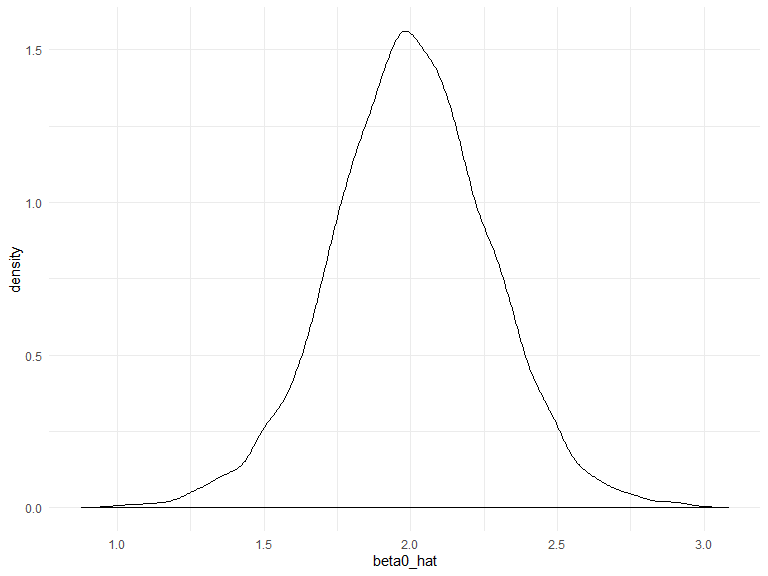
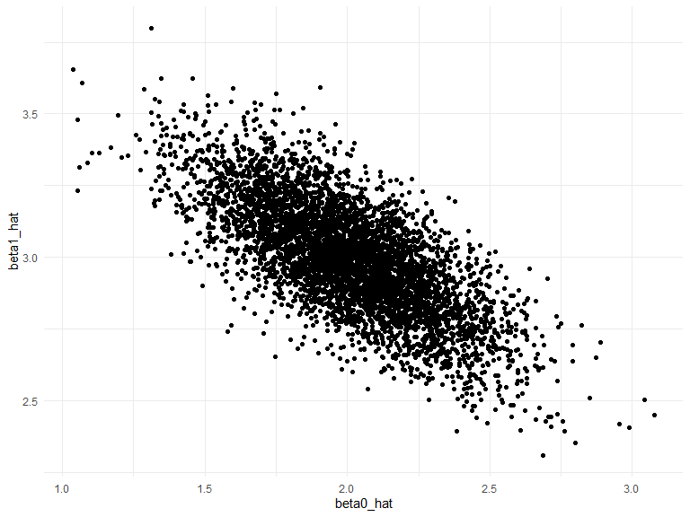

Simulations\!
================
Alexis
10/28/2019

## Time to simulate

``` r
set.seed(1)
```

Re-use the function from a few lectures ago

``` r
sim_regression = function(n, beta0 = 2, beta1 = 3) {
  
  sim_data = tibble(
    x = rnorm(n, mean = 1, sd = 1),
    y = beta0 + beta1 * x + rnorm(n, 0, 1)
  )
  
  ls_fit = lm(y ~ x, data = sim_data)
  
  tibble(
    beta0_hat = coef(ls_fit)[1],
    beta1_hat = coef(ls_fit)[2]
  )
}
```

``` r
sim_regression(n = 30)
```

    ## # A tibble: 1 x 2
    ##   beta0_hat beta1_hat
    ##       <dbl>     <dbl>
    ## 1      2.09      3.04

## rerun using a for loop

``` r
output = vector("list", length = 5000)

for (i in 1:5000) {
  output[[i]] = sim_regression(n = 30)
}

bind_rows(output)
```

    ## # A tibble: 5,000 x 2
    ##    beta0_hat beta1_hat
    ##        <dbl>     <dbl>
    ##  1      2.11      3.00
    ##  2      2.44      2.70
    ##  3      1.83      2.94
    ##  4      2.21      2.93
    ##  5      1.71      3.24
    ##  6      2.37      2.83
    ##  7      1.91      3.15
    ##  8      1.80      3.11
    ##  9      1.79      3.33
    ## 10      1.31      3.24
    ## # ... with 4,990 more rows

``` r
bind_rows(output) %>%
  ggplot(aes(x = beta0_hat)) + geom_density()
```



## rerun simulation using `purrr`

``` r
output = 
  rerun(5000, sim_regression(n = 30)) %>%
  bind_rows
```

``` r
output %>%
  ggplot(aes(x = beta0_hat, y = beta1_hat)) + 
  geom_point()
```


