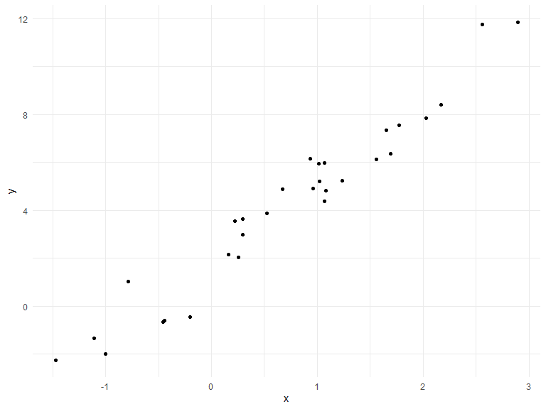

Writing Functions
================
Alexis
10/28/2019

## Get started

We’re going to write some functions.

Z-scores

``` r
x = rnorm(n = 30, mean = 4, sd = 2.3)
x_again = rnorm(n = 30, mean = 6, sd = .3)
y = rnorm(n = 30, mean = 24, sd = 2.3)

(x - mean(x)) / sd(x)
```

    ##  [1]  0.61154776  0.60754368  0.08808226  0.45414556 -1.32652245
    ##  [6] -0.57209709 -1.83311976  1.10470075  1.66986527 -0.06275073
    ## [11]  1.44356033  0.34227731 -0.27075565 -0.18218465 -1.13393777
    ## [16]  0.42203506  0.83746236  0.56103889 -0.05162194 -0.32031337
    ## [21]  0.03584844  2.21161892 -0.81743016 -1.90851795 -0.49492807
    ## [26]  0.02785493  0.20522432 -0.16662802 -1.98057322  0.49857498

``` r
(x_again - mean(x_again)) / sd(x_again)
```

    ##  [1] -1.797093323  0.931996450 -0.428446958  1.405269637 -1.175218941
    ##  [6]  0.107909274 -0.045441986  0.711418430 -0.839327357  0.040859228
    ## [11]  0.146294553 -0.851258369 -0.846832384 -0.599160576 -0.896620104
    ## [16] -0.510408497 -1.283019009  1.526179760  0.555924380  1.013622309
    ## [21]  0.590679741  0.156139889 -0.006692951  0.588652204  2.266125973
    ## [26] -2.188279859  0.941038611  0.265512794 -0.286086600  0.506263681

Now a function

``` r
z_score = function(x_arg) {
  
  if (!is.numeric(x_arg)) {
    stop("x should be numeric")
  } else if (length(x_arg) < 3) {
    stop("x should be longer than 3")
  }
  
  (x_arg - mean(x_arg)) / sd(x_arg)
}
```

Try out the function.

``` r
z_score(x_arg = y)
```

    ##  [1]  2.02088188 -1.85493166 -1.93679227  0.07540839 -0.05935799
    ##  [6]  1.71830289 -0.17968912 -0.79587500  0.16417502  0.76850745
    ## [11] -0.35948442 -0.14966372 -0.78466377  0.33095352  0.37742945
    ## [16] -0.03733247  2.59944778 -0.49432077 -0.01297968 -1.58572601
    ## [21]  0.12863692 -0.27804766  0.56508231  0.21119906 -0.23326135
    ## [26]  0.20939624  0.82669043 -1.22356990 -0.32579374  0.31537818

``` r
#these should not work given the function:
#z_score(x_arg = 3)
#z_score(x_arg = "my name is jeff")
#z_score(x_arg = c(TRUE, TRUE, FALSE, TRUE))
#z_score(x_arg = iris)
```

## Multiple outputs

``` r
mean_and_sd = function(input_x) {
  
   if (!is.numeric(input_x)) {
    stop("x should be numeric")
  } else if (length(input_x) < 3) {
    stop("x should be longer than 3")
  }

tibble(
  mean_input = mean(input_x),
  sd_input = sd(input_x)  
)

}
```

test this function

``` r
mean_and_sd(input_x = y)
```

    ## # A tibble: 1 x 2
    ##   mean_input sd_input
    ##        <dbl>    <dbl>
    ## 1       24.2     1.92

using list

``` r
mean_and_sd = function(input_x) {
  
   if (!is.numeric(input_x)) {
    stop("x should be numeric")
  } else if (length(input_x) < 3) {
    stop("x should be longer than 3")
  }
  
  list(
    mean_input = mean(input_x),
    sd_input = sd(input_x),
    z_score = (input_x - mean(input_x)) / sd(input_x)
)
}
```

``` r
mean_and_sd(input_x = y)
```

    ## $mean_input
    ## [1] 24.18169
    ## 
    ## $sd_input
    ## [1] 1.922203
    ## 
    ## $z_score
    ##  [1]  2.02088188 -1.85493166 -1.93679227  0.07540839 -0.05935799
    ##  [6]  1.71830289 -0.17968912 -0.79587500  0.16417502  0.76850745
    ## [11] -0.35948442 -0.14966372 -0.78466377  0.33095352  0.37742945
    ## [16] -0.03733247  2.59944778 -0.49432077 -0.01297968 -1.58572601
    ## [21]  0.12863692 -0.27804766  0.56508231  0.21119906 -0.23326135
    ## [26]  0.20939624  0.82669043 -1.22356990 -0.32579374  0.31537818

## Multiple inputs

``` r
sim_data = tibble(
  x = rnorm(30, mean = 1, sd = 1),
  y = 2 + 3 * x + rnorm(30, 0, 1)
)

sim_data %>%
  ggplot(aes(x = x, y = y)) +
  geom_point()
```



``` r
ls_fit = lm(y ~ x, data = sim_data)
  
beta0_hat = coef(ls_fit)[1]
beta1_hat = coef(ls_fit)[2]
```

``` r
sim_regression = function(n) {
  
  sim_data = tibble(
    x = rnorm(n, mean = 1, sd = 1),
    y = 2 + 3 * x + rnorm(n, 0, 1)
)

ls_fit = lm(y ~ x, data = sim_data)

tibble(
  beta0_hat = coef(ls_fit)[1],
  beta1_hat = coef(ls_fit)[2]  
) 

}

sim_regression(n = 3000)
```

    ## # A tibble: 1 x 2
    ##   beta0_hat beta1_hat
    ##       <dbl>     <dbl>
    ## 1      2.00      3.01

``` r
sim_regression = function(n, beta0, beta1) {
  
  sim_data = tibble(
    x = rnorm(n, mean = 1, sd = 1),
    y = beta0 + beta1 * x + rnorm(n, 0, 1)
)

ls_fit = lm(y ~ x, data = sim_data)

tibble(
  beta0_hat = coef(ls_fit)[1],
  beta1_hat = coef(ls_fit)[2]  
) 

}

sim_regression(n = 3000, beta0 = 1, beta1 = 3)
```

    ## # A tibble: 1 x 2
    ##   beta0_hat beta1_hat
    ##       <dbl>     <dbl>
    ## 1     0.994      3.00

``` r
sim_regression(3000, 17, -3)
```

    ## # A tibble: 1 x 2
    ##   beta0_hat beta1_hat
    ##       <dbl>     <dbl>
    ## 1      17.0     -3.00

``` r
sim_regression = function(n, beta0 = 2, beta1 = 3) {
  
  sim_data = tibble(
    x = rnorm(n, mean = 1, sd = 1),
    y = beta0 + beta1 * x + rnorm(n, 0, 1)
)

ls_fit = lm(y ~ x, data = sim_data)

tibble(
  beta0_hat = coef(ls_fit)[1],
  beta1_hat = coef(ls_fit)[2]  
) 

}

sim_regression(n = 3000, beta0 = 1, beta1 = 3)
```

    ## # A tibble: 1 x 2
    ##   beta0_hat beta1_hat
    ##       <dbl>     <dbl>
    ## 1     0.978      3.00

``` r
sim_regression(3000)
```

    ## # A tibble: 1 x 2
    ##   beta0_hat beta1_hat
    ##       <dbl>     <dbl>
    ## 1      2.04      2.99

## Scrape lots of napolean

``` r
url = "https://www.amazon.com/product-reviews/B00005JNBQ/ref=cm_cr_arp_d_viewopt_rvwer?ie=UTF8&reviewerType=avp_only_reviews&sortBy=recent&pageNumber=1"

dynamite_html = read_html(url)

review_titles = 
  dynamite_html %>%
  html_nodes("#cm_cr-review_list .review-title") %>%
  html_text()

review_stars = 
  dynamite_html %>%
  html_nodes("#cm_cr-review_list .review-rating") %>%
  html_text()

review_text = 
  dynamite_html %>%
    html_nodes(".review-data:nth-child(4)") %>%
    html_text()

reviews = tibble(
  title = review_titles,
  stars = review_stars,
  text = review_text
)
```

Now as a function

``` r
read_page_reviews = function(page_url) {
 
  dynamite_html = read_html(page_url)

  review_titles = 
    dynamite_html %>%
    html_nodes("#cm_cr-review_list .review-title") %>%
    html_text()

  review_stars = 
    dynamite_html %>%
    html_nodes("#cm_cr-review_list .review-rating") %>%
  html_text()

  review_text = 
    dynamite_html %>%
    html_nodes(".review-data:nth-child(4)") %>%
    html_text()

  reviews = tibble(
    title = review_titles,
    stars = review_stars,
    text = review_text
)
  reviews
}
```

``` r
read_page_reviews("https://www.amazon.com/product-reviews/B00005JNBQ/ref=cm_cr_arp_d_viewopt_rvwer?ie=UTF8&reviewerType=avp_only_reviews&sortBy=recent&pageNumber=1")
```

    ## # A tibble: 10 x 3
    ##    title                           stars         text                      
    ##    <chr>                           <chr>         <chr>                     
    ##  1 "Gotta watch it!\n            " 5.0 out of 5~ Format: Prime VideoVerifi~
    ##  2 "Great movie\n            "     5.0 out of 5~ Format: Blu-rayVerified P~
    ##  3 "Duh\n            "             5.0 out of 5~ Format: Prime VideoVerifi~
    ##  4 "Great video\n            "     5.0 out of 5~ Format: DVDVerified Purch~
    ##  5 "Give me some of your tots\n  ~ 5.0 out of 5~ Format: Prime VideoVerifi~
    ##  6 "Nostalgic\n            "       5.0 out of 5~ Format: Prime VideoVerifi~
    ##  7 "Make you giggle type movie\n ~ 5.0 out of 5~ Format: Blu-rayVerified P~
    ##  8 "This movie is so stupid.\n   ~ 5.0 out of 5~ Format: Prime VideoVerifi~
    ##  9 "Hilarious\n            "       5.0 out of 5~ Format: Prime VideoVerifi~
    ## 10 "Waste of money\n            "  1.0 out of 5~ Format: Prime VideoVerifi~

``` r
read_page_reviews("https://www.amazon.com/product-reviews/B00005JNBQ/ref=cm_cr_arp_d_viewopt_rvwer?ie=UTF8&reviewerType=avp_only_reviews&sortBy=recent&pageNumber=2")
```

    ## # A tibble: 10 x 3
    ##    title                               stars        text                   
    ##    <chr>                               <chr>        <chr>                  
    ##  1 "Good movie\n            "          5.0 out of ~ Format: Prime VideoVer~
    ##  2 "A classic\n            "           5.0 out of ~ Format: Prime VideoVer~
    ##  3 "FRIKKEN SWEET MOVIE, GAWSH.\n    ~ 5.0 out of ~ Format: Prime VideoVer~
    ##  4 "You gonna eat the rest of your to~ 5.0 out of ~ Format: Prime VideoVer~
    ##  5 "Tina you fat lard come get some d~ 5.0 out of ~ Format: Prime VideoVer~
    ##  6 "Great family movie\n            "  5.0 out of ~ Format: Blu-rayVerifie~
    ##  7 "Teens love it\n            "       5.0 out of ~ Format: Prime VideoVer~
    ##  8 "Great\n            "               5.0 out of ~ Format: DVDVerified Pu~
    ##  9 "Great Movie, Bad Packaging\n     ~ 4.0 out of ~ Format: Blu-rayVerifie~
    ## 10 "jeez napoleon\n            "       5.0 out of ~ Format: Prime VideoVer~

``` r
read_page_reviews("https://www.amazon.com/product-reviews/B00005JNBQ/ref=cm_cr_arp_d_viewopt_rvwer?ie=UTF8&reviewerType=avp_only_reviews&sortBy=recent&pageNumber=3")
```

    ## # A tibble: 10 x 3
    ##    title                             stars         text                    
    ##    <chr>                             <chr>         <chr>                   
    ##  1 "\U0001f44d\n            "        5.0 out of 5~ Format: Prime VideoVeri~
    ##  2 "A classic!\n            "        5.0 out of 5~ Format: DVDVerified Pur~
    ##  3 "A must own\n            "        5.0 out of 5~ Format: Prime VideoVeri~
    ##  4 "If you like 80s ...you must wat~ 5.0 out of 5~ Format: Prime VideoVeri~
    ##  5 "\U0001f918\n            "        5.0 out of 5~ Format: Prime VideoVeri~
    ##  6 "Super Slow Mooovie...\n        ~ 1.0 out of 5~ Format: Prime VideoVeri~
    ##  7 "Awesome!\n            "          5.0 out of 5~ Format: Prime VideoVeri~
    ##  8 "Very funny\n            "        4.0 out of 5~ Format: Prime VideoVeri~
    ##  9 "Eat your food tina\n           ~ 5.0 out of 5~ Format: Prime VideoVeri~
    ## 10 "Dumb funny\n            "        5.0 out of 5~ Format: DVDVerified Pur~
