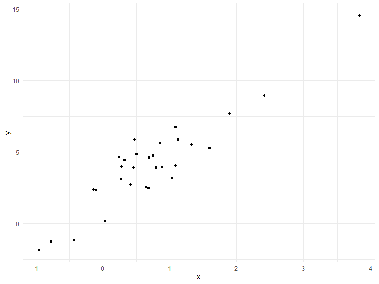

Writing Functions
================
Alexis
10/28/2019

## Get started

We’re going to write some functions.

Z-scores

``` r
x = rnorm(n = 30, mean = 4, sd = 2.3)
x_again = rnorm(n = 30, mean = 6, sd = .3)
y = rnorm(n = 30, mean = 24, sd = 2.3)

(x - mean(x)) / sd(x)
```

    ##  [1] -1.243804839 -2.166144154  0.384616580  0.531612213  1.399860168
    ##  [6]  0.549228945  1.247499947  0.638441111 -1.099290226 -0.007980019
    ## [11] -0.338143320 -1.219182184  0.439432784  0.297530552  0.130306895
    ## [16] -0.389917550  0.578092231  0.624804100  1.425713044  1.192371223
    ## [21]  0.873260406 -2.288043912  0.471794135 -0.529852122 -0.287377579
    ## [26]  1.377775629 -0.322971998 -1.047731810 -0.267621039 -0.954279211

``` r
(x_again - mean(x_again)) / sd(x_again)
```

    ##  [1]  1.03499725  0.45662040  1.93908408  1.37092607  1.16342746
    ##  [6] -0.20121277 -0.26867014 -0.89870753  0.19903653  0.48176681
    ## [11] -0.07062336  2.39648312 -1.29063840  0.36873962  0.37498552
    ## [16] -0.13434821  0.19098045  1.73419921 -0.88426925 -0.36411604
    ## [21] -0.65463030 -0.50862130 -1.78941510 -0.97885587 -0.68465612
    ## [26] -0.75138228 -0.63379062 -0.92537601  0.16590389 -0.83783712

Now a function

``` r
z_score = function(x_arg) {
  
  if (!is.numeric(x_arg)) {
    stop("x should be numeric")
  } else if (length(x_arg) < 3) {
    stop("x should be longer than 3")
  }
  
  (x_arg - mean(x_arg)) / sd(x_arg)
}
```

Try out the function.

``` r
z_score(x_arg = y)
```

    ##  [1]  0.43028747  0.31564227 -0.53699066 -1.18437895 -0.36429553
    ##  [6] -1.98756950  0.96252824 -0.68151006  1.98305689 -0.06913172
    ## [11]  0.31107067 -2.40514917  0.42849490 -0.28715394 -0.16729098
    ## [16] -0.22120350  0.85029402 -0.48976166 -0.65651832  0.90772115
    ## [21]  1.80849439  0.35790116 -0.22238463  1.56376498 -1.21099441
    ## [26] -0.54780836  0.61938899 -0.18228963  0.99555838 -0.31977249

``` r
#these should not work given the function:
#z_score(x_arg = 3)
#z_score(x_arg = "my name is jeff")
#z_score(x_arg = c(TRUE, TRUE, FALSE, TRUE))
#z_score(x_arg = iris)
```

## Multiple outputs

``` r
mean_and_sd = function(input_x) {
  
   if (!is.numeric(input_x)) {
    stop("x should be numeric")
  } else if (length(input_x) < 3) {
    stop("x should be longer than 3")
  }

tibble(
  mean_input = mean(input_x),
  sd_input = sd(input_x)  
)

}
```

test this function

``` r
mean_and_sd(input_x = y)
```

    ## # A tibble: 1 x 2
    ##   mean_input sd_input
    ##        <dbl>    <dbl>
    ## 1       24.3     2.14

using list

``` r
mean_and_sd = function(input_x) {
  
   if (!is.numeric(input_x)) {
    stop("x should be numeric")
  } else if (length(input_x) < 3) {
    stop("x should be longer than 3")
  }
  
  list(
    mean_input = mean(input_x),
    sd_input = sd(input_x),
    z_score = (input_x - mean(input_x)) / sd(input_x)
)
}
```

``` r
mean_and_sd(input_x = y)
```

    ## $mean_input
    ## [1] 24.28646
    ## 
    ## $sd_input
    ## [1] 2.142225
    ## 
    ## $z_score
    ##  [1]  0.43028747  0.31564227 -0.53699066 -1.18437895 -0.36429553
    ##  [6] -1.98756950  0.96252824 -0.68151006  1.98305689 -0.06913172
    ## [11]  0.31107067 -2.40514917  0.42849490 -0.28715394 -0.16729098
    ## [16] -0.22120350  0.85029402 -0.48976166 -0.65651832  0.90772115
    ## [21]  1.80849439  0.35790116 -0.22238463  1.56376498 -1.21099441
    ## [26] -0.54780836  0.61938899 -0.18228963  0.99555838 -0.31977249

## Multiple inputs

``` r
sim_data = tibble(
  x = rnorm(30, mean = 1, sd = 1),
  y = 2 + 3 * x + rnorm(30, 0, 1)
)

sim_data %>%
  ggplot(aes(x = x, y = y)) +
  geom_point()
```



``` r
ls_fit = lm(y ~ x, data = sim_data)
  
beta0_hat = coef(ls_fit)[1]
beta1_hat = coef(ls_fit)[2]
```

``` r
sim_regression = function(n) {
  
  sim_data = tibble(
    x = rnorm(n, mean = 1, sd = 1),
    y = 2 + 3 * x + rnorm(n, 0, 1)
)

ls_fit = lm(y ~ x, data = sim_data)

tibble(
  beta0_hat = coef(ls_fit)[1],
  beta1_hat = coef(ls_fit)[2]  
) 

}

sim_regression(n = 3000)
```

    ## # A tibble: 1 x 2
    ##   beta0_hat beta1_hat
    ##       <dbl>     <dbl>
    ## 1      1.97      3.02

``` r
sim_regression = function(n, beta0, beta1) {
  
  sim_data = tibble(
    x = rnorm(n, mean = 1, sd = 1),
    y = beta0 + beta1 * x + rnorm(n, 0, 1)
)

ls_fit = lm(y ~ x, data = sim_data)

tibble(
  beta0_hat = coef(ls_fit)[1],
  beta1_hat = coef(ls_fit)[2]  
) 

}

sim_regression(n = 3000, beta0 = 1, beta1 = 3)
```

    ## # A tibble: 1 x 2
    ##   beta0_hat beta1_hat
    ##       <dbl>     <dbl>
    ## 1     0.976      3.01

``` r
sim_regression(3000, 17, -3)
```

    ## # A tibble: 1 x 2
    ##   beta0_hat beta1_hat
    ##       <dbl>     <dbl>
    ## 1      17.0     -3.00

``` r
sim_regression = function(n, beta0 = 2, beta1 = 3) {
  
  sim_data = tibble(
    x = rnorm(n, mean = 1, sd = 1),
    y = beta0 + beta1 * x + rnorm(n, 0, 1)
)

ls_fit = lm(y ~ x, data = sim_data)

tibble(
  beta0_hat = coef(ls_fit)[1],
  beta1_hat = coef(ls_fit)[2]  
) 

}

sim_regression(n = 3000, beta0 = 1, beta1 = 3)
```

    ## # A tibble: 1 x 2
    ##   beta0_hat beta1_hat
    ##       <dbl>     <dbl>
    ## 1     0.967      3.01

``` r
sim_regression(3000)
```

    ## # A tibble: 1 x 2
    ##   beta0_hat beta1_hat
    ##       <dbl>     <dbl>
    ## 1      1.98      3.00
